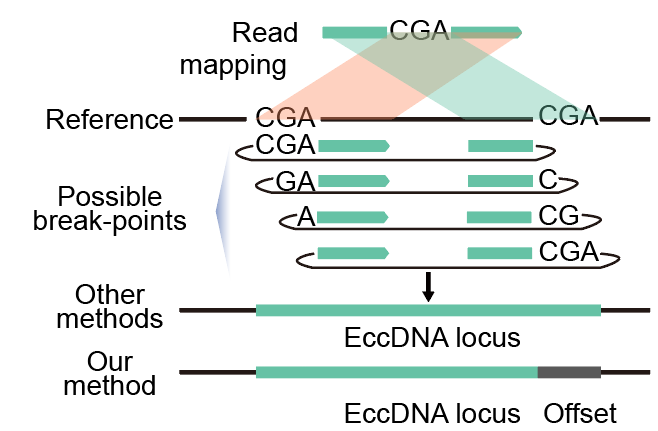

# eccDNA_detector_tools  

## Introduction  
We developed a nucleotide-resolution eccDNA detection pipeline on the basis of previous efforts (Kumar et al., 2017; Moller et al., 2018). Briefly, SeqPrep (https://github.com/jstjohn/SeqPrep) was used to trim adapter sequences and merge the overlapping paired-end reads into singleton long reads, followed by reads mapping to GRCm38 reference genome using BWA MEM, Samblaster or an in-house Perl script was used to remove PCR duplicates and separate alignments into split reads, discordant and concordant reads. Candidate eccDNAs are firstly identified based on split reads (high-confidence ones). When homologous sequences are present at eccDNA ends, we recorded the coordinates of the leftmost form of eccDNA and an offset corresponding to the length of homologous sequences to represent all possible eccDNA variants. Potential split reads that failed to be mapped as split reads in the first place (low-confidence ones) as well as discordant reads were identified and counted using in-house Perl scripts. The average coverages (in terms of RPK) for candidate eccDNAs and surrounding regions were then calculated based on all different type of reads. Any eccDNA supported by at least two high-confidence split reads or discordant reads, with its 95% region covered by at least one read, and with its average coverage twice of that of its surrounding region, is considered as a high-confidence eccDNA. 


Kumar, P., Dillon, L.W., Shibata, Y., Jazaeri, A.A., Jones, D.R., and Dutta, A. (2017). Normal and Cancerous Tissues Release Extrachromosomal Circular DNA (eccDNA) into the Circulation. Mol Cancer Res 15, 1197-1205.  
Moller, H.D., Mohiyuddin, M., Prada-Luengo, I., Sailani, M.R., Halling, J.F., Plomgaard, P., Maretty, L., Hansen, A.J., Snyder, M.P., Pilegaard, H., et al. (2018). Circular DNA elements of chromosomal origin are common in healthy human somatic tissue. Nat Commun 9, 1069.  

## Installation  
In order to utilize the eccDNA detector tool, you must first download the package listed in the table. We recommend using conda to install.  
Following list was the detailed dependence:
software  |version
|:---:  |:---:|
|SeqPrep|v. 1.2  |
| bwa | v. 0.7.17-r1188 |
|samblaster  |v. 0.1.26  |
|samtools  | v. 1.7 |
| bedtools |v. 2.30.0  |  

Then, you need to add the tool to your path.  
```
export PATH=$PATH:/home/username/eccDNA_detector_tools/  
export PATH=$PATH:/home/username/eccDNA_detector_tools/scripts  
source ~/.bashrc  
```
## Usage  
### step1 Mapping  
```
mapping.sh -1 read1.fq.gz -2 read2.fq.gz  -i bwa_genome_index -o out_dir -p output_prefix -t 12  
Usage: mapping.sh Options
Options:
  -1|--r1           PATH    read 1 in fastq(.gz) format
  -2|--r2           PATH    read 2 in fastq(.gz) format
  -a|--adaptor      CHAR    3' adapter to be removed from read 1 in a pair [AGATCGGAAGAGCACACGTC]
  -A|--ADAPTOR      CHAR    3' adapter to be removed from read 2 in a pair [AGATCGGAAGAGCGTCGTGT]
  -i|--index        PREFIX  BWA Index prefix
  -o|--outDir       PATH    Output directory [./]
  -p|--prefix       CHAR    prefix of output files [out]
  -t|--thread       INT     The thread number [1]
  -h|--help
Dependencies:
  SeqPrep; samblaster v0.1.25; bwa v0.7.17-r1188; samtools v1.3.1

```
The output dir contain four type files
```
output_prefix.pe.disc.bam  output_prefix.pe.rmdup.bam  output_prefix.pe.split.bam  output_prefix.se.bam  output_prefix.se.rmdup.bam
```

### step2  Detecting  
```
detector.sh -i output_prefix -g genome.fa -s genome.size -o outputdir  
Usage: detector.sh Options
Options:
  -i|--input        BASE    prefix of the mapping.sh output
  -q|--mapq         INT     min mapping quality [20]
  -v|--overhang     INT     min length of overhangs beyond homology regions for lconf split reads detection [10]
  -g|--genome       FILE    genome sequence in fasta format
  -s|--size         FILE    text file for chromosome sizes
  -d|--distance     INT     max distance between 2 properly-paired / discordant reads [500]
  -l|--largest      INT     candidate eccDNA larger than [-l|--largest] will be disgarded [5000000]
  -o|--outDir       PATH    Output directory [./]
  -h|--help
Dependencies:
  samtools; bedtools
```  
The output dir contain 7 files  
```
output_prefix.eccDNA  output_prefix.cov  output_prefix.bed  output_prefix.eccDNA+reads  output_prefix.id.passed  output_prefix.lconf.out  output_prefix.bks.indi
```
### step3 Filter high-confidence eccDNA
```
cat output_prefix.eccDNA |sed '/chrM/d'|awk 'BEGIN{OFS="\t"}($6+$8)>=2&&$9>=0.95&&$10>=2*($11+$12){print $0}'|bedtools intersect -a - -b blacklist.bed -v > output_prefix.high
```
The output of the output_prefix.high:  
chr|start | end | id  | offset | hconf_split | lconf_split | disc | coverage(0-1) | cov(RPK) | cov_upstream(RPK) | cov_downstream(RPK)
|:---:  |:---:|:---:  |:---:|:---:  |:---:|:---:  |:---:|:---:  |:---:|:---:  |:---:|
chr1 | 3185944 | 3186389|3 | 2  |12  |4  |3   | 1  | 85.0112 |0     | 2.24719
chr1    3640088 3641015 7       2       4       1       1       1       51.6685 0       0
chr1    4995630 4995934 17      0       12      2       0       1       52.6316 0       0
chr1    6874001 6874433 30      0       38      56      25      1       490.741 2.31481 2.31481
chr1    10868069        10868594        58      1       4       1       0       1       17.1103 0       0
chr1    11799435        11799570        66      0       1       0       1       1       44407.4 0       0
chr1    11799436        11799571        67      0       3778    920     3       1       44407.4 0       0
### step4 Generate bigwig file  
```
bed2bw_notscaled.sh output_prefix.bed output_prefix genome.size

Options:  
$1 The .bed file in the step2 output dir
$2 The output bigwig prefix
$3 The genome size

```

